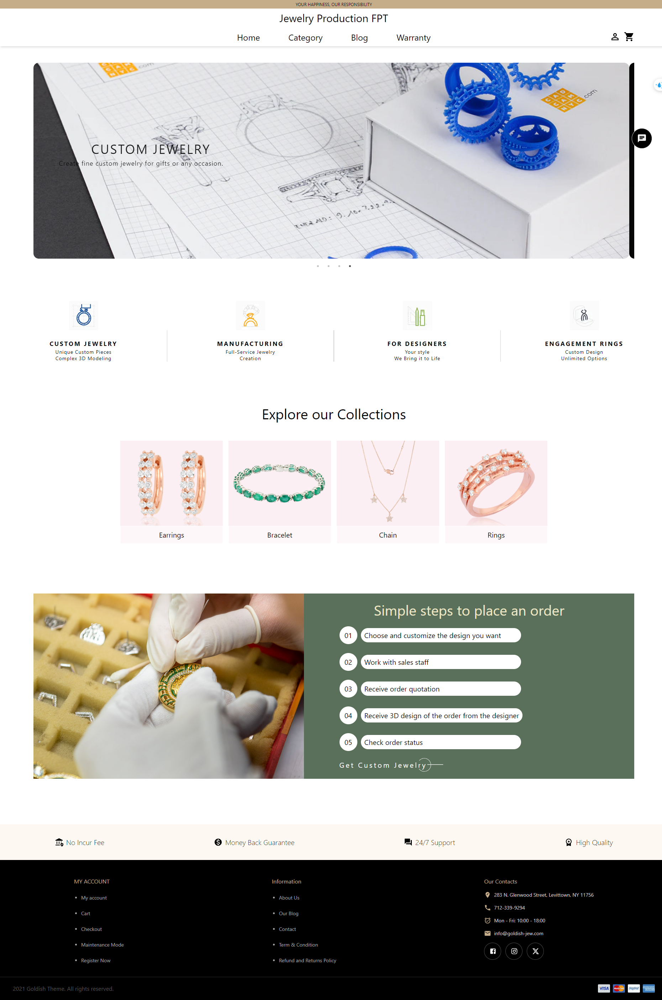
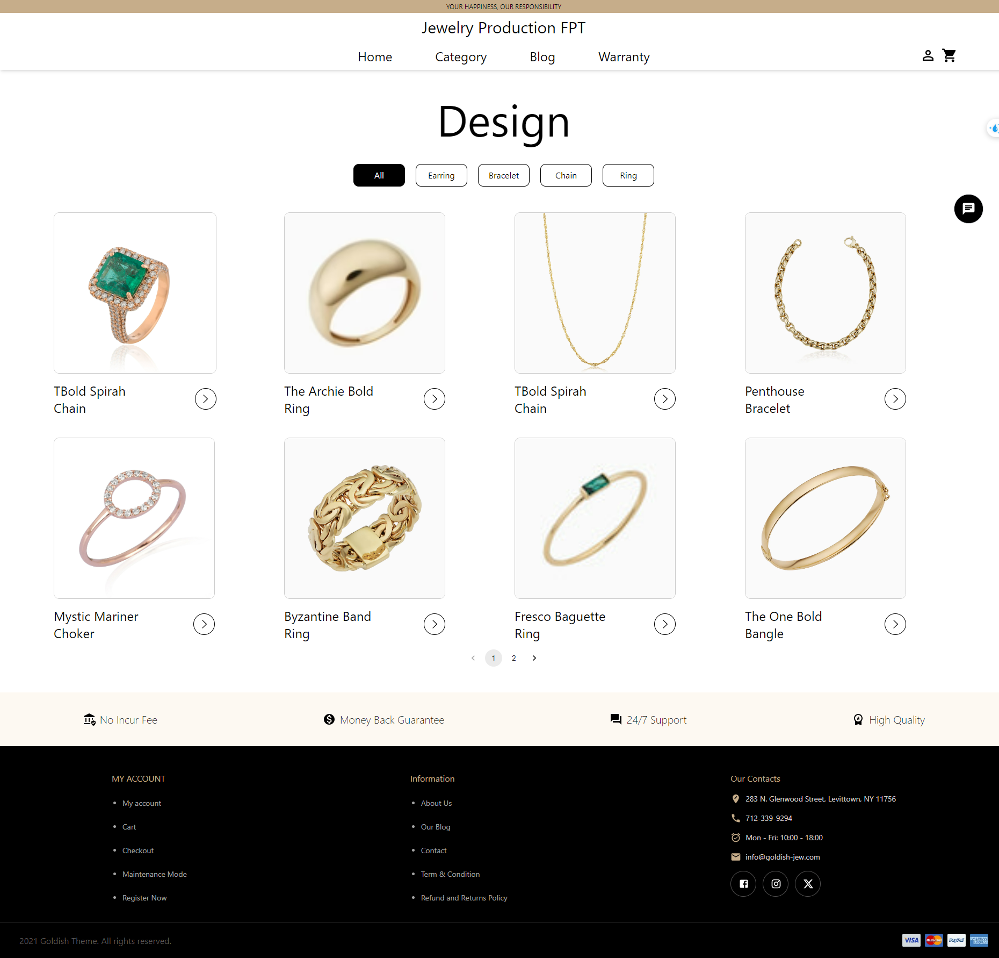
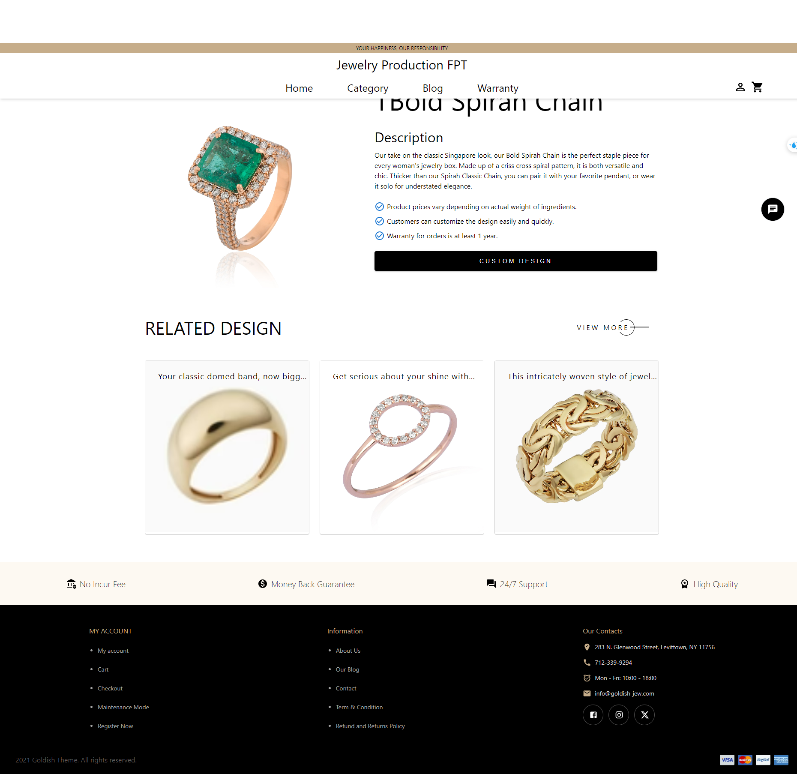
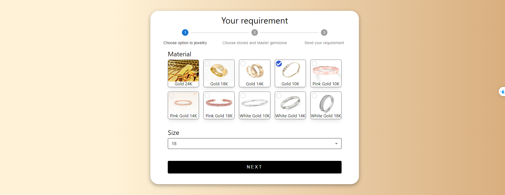
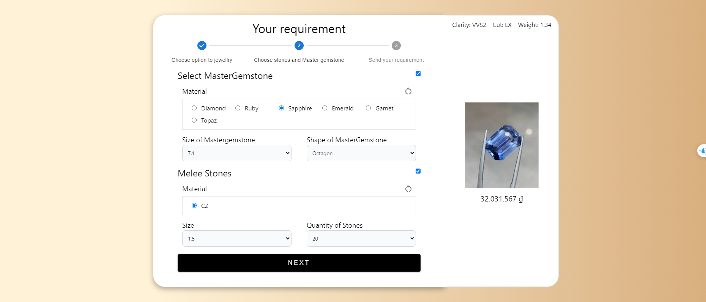
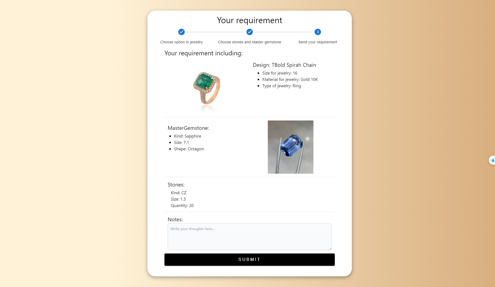
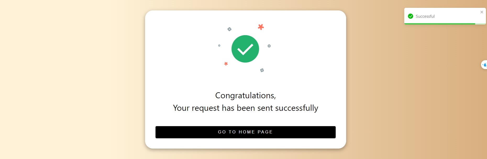
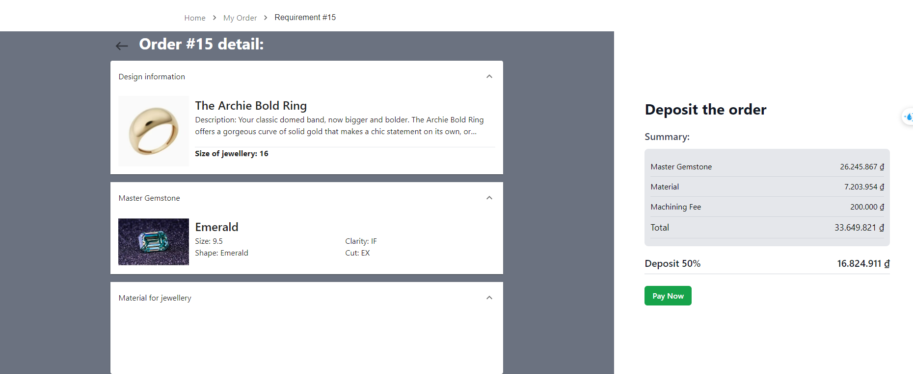
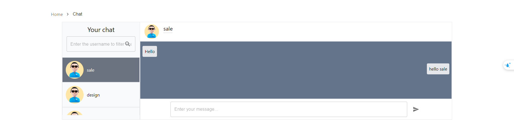

# Jewellery Production Order System

## Overview
The Jewellery Production Order System is a software solution designed to streamline and manage the creation, customization, and ordering processes of jewelry production.

## Table of Contents
1. [Features](#features)
2. [Code Structure](#code-structure)
3. [Database Design](#database-design)
4. [Screenshots](#screenshots)
5. [Getting Started](#getting-started)
6. [Project Documentation](#project-documentation)
7. [Contributing](#contributing)
8. [License](#license)

## Features
- **User Registration & Login:** Secure authentication system for users to register and log into the application.
- **Jewelry Design Management:** Create and manage jewelry designs with features like adding materials, stones, and other details.
- **Custom Requirements:** Users can create custom requirements based on design and jewelry type.
- **Order & Payment Management:** Track order requirements, manage payment methods, and store transaction history.
- **Blog Module:** Content management for blog posts to attract and inform users.
- **Warranty and Maintenance Tracking:** Manage warranty information for each piece of jewelry.

## Screenshots

1. **Home Page** - The initial view of the website where users can explore various jewelry products.
   

2. **Product List** - A list of jewelry categories available for selection.
   

3. **Product Details** - Detailed information about a selected product, including price and customization options.
   

4. **Step One - Selecting Customization** - Users begin the customization process by selecting options such as size or material.
   

5. **Step Two - Confirming Customization** - Users confirm the selected options before proceeding with the order.
   

6. **Confirmation Screen** - Final confirmation of the selection and customization before placing the order.
   

7. **Order Success** - The success message that appears after the order is successfully placed.
   

8. **Tracking Order** - A screen that allows users to track the status of their orders.
   

9. **Realtime Chat View** - Realtime chat interface for users to communicate with customer support.
   

## Code Structure

| Package             | Description                                                                 |
|---------------------|-----------------------------------------------------------------------------|
| **Unit of Work**    | Manages database transactions.                                              |
| **Generic Repository** | Defines CRUD operations for entity repositories.                           |
| **Entity**          | Defines classes for each database entity.                                   |
| **Model**           | Manages data models for controlled data transfer.                           |
| **Controllers**     | Receives requests from the frontend and sends responses.                    |
| **Services**        | Provides support for external API integration.                              |
| **API**             | Offers APIs for accessing application data and functionalities.             |

## Database Design

The database is structured to efficiently manage jewelry production, customization requirements, and user interactions. Key tables include:

| Table Name           | Description                                                                                 |
|----------------------|---------------------------------------------------------------------------------------------|
| **Design**           | Stores jewelry design details, including weight and images.                                 |
| **Requirements**     | Tracks user specifications for custom jewelry.                                              |
| **Stones**           | Stores information on gemstones, such as size and quantity.                                 |
| **Material**         | Describes materials used in jewelry (e.g., gold, silver).                                   |
| **TypeOfJewelry**    | Defines types of jewelry (e.g., rings, bracelets).                                          |
| **WarrantyCard**     | Manages warranty information for jewelry.                                                   |
| **UserRequirements** | Tracks user-specific customizations and requirements.                                       |
| **AspNetUsers**      | Manages application users, including authentication details.                                |

## Getting Started

1. **Clone the repository:**
   ```bash
   git clone https://github.com/PhucLocNguyen/N2_NET1806_SWP.git
   cd N2_NET1806_SWP
